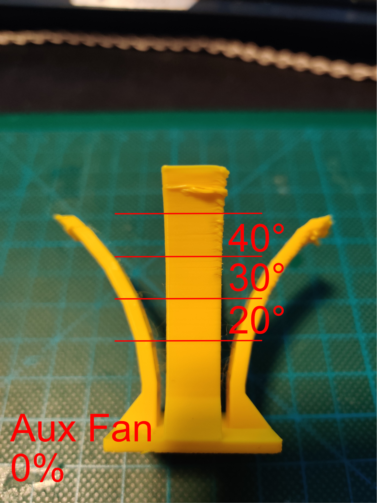
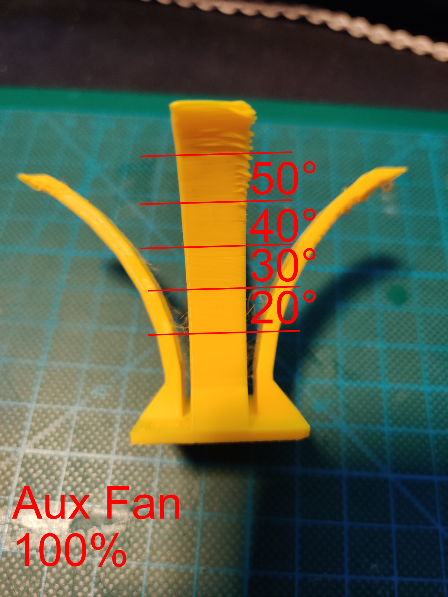
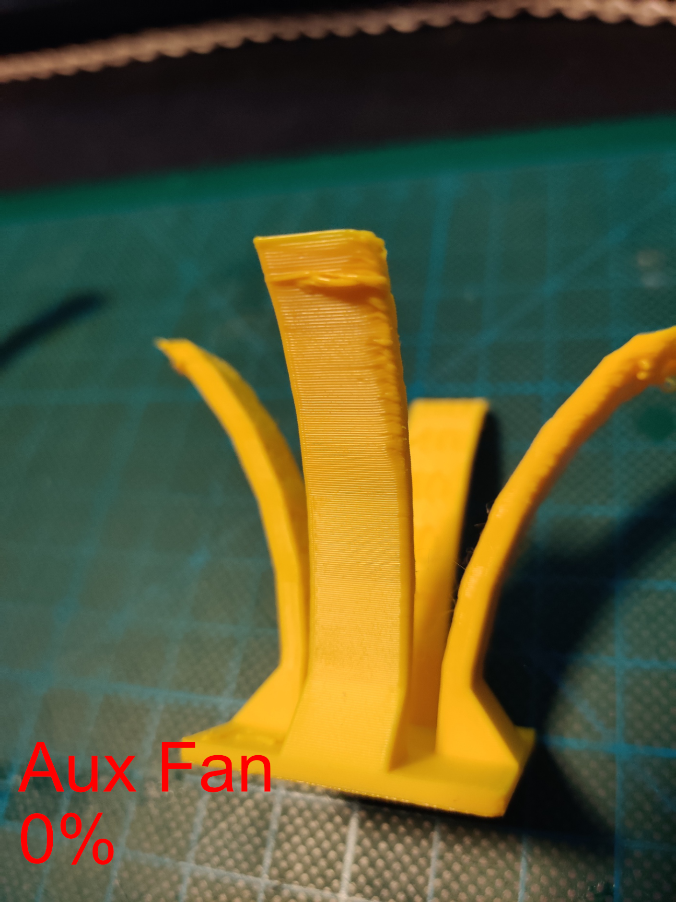
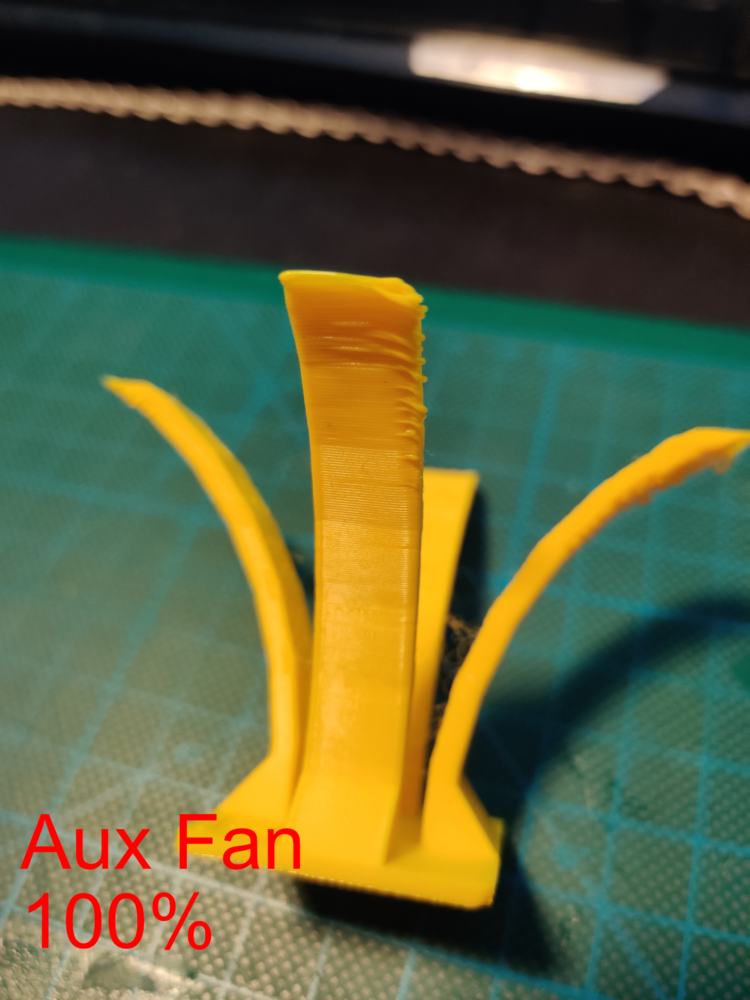

# 5015 Blower Fan Test
## PLA
Test File: [Overhang Test by tomi3d](https://www.printables.com/model/126029-overhang-test)

Test was run with around 100 mm/s for most features, so the Overhangs look pretty bad however this stressed cooling performance more. This also meant that the prints got knocked of the print bed before completeing because the nozzle crashed into curled up parts. The Print with the aux fan on managed to print to the middle of the 60° Overhang, without the fan the print got knocked of at the middle of 50°.

The Toolhead was the Mini-Stealthburner from the V0.2.

Nozzle-Temperature 205°C, Part-Cooling-Fan (Toolhead) 100% fixed.

Pictured is only the arc that was facing the aux fan, as the other ones aren't really affected by the aux fan. The 5015 Blower fan does not have enough power to have a meaningful impact over the whole print area, or the fan duct is designed really inefficiently.

As you can see from the pictures without a fan the curling starts at around 30° overhang, with the aux fan at 100% curling starts at 40° overhang.

