# V0 Auxilliary Cooling Fan

Auxilliary Cooling Fan using a 5015 Blower Fan for the Voron V0 3d-Printers.

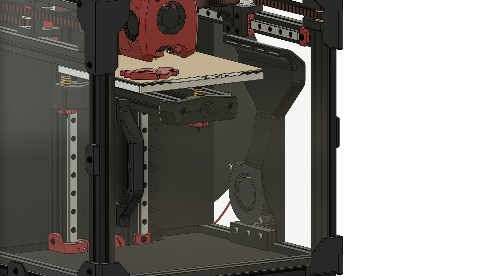

The Shroud can be easily installed after the Printer has already been fully assembled, as it just slots into either the left or right bottom extrusion and gets clamped onto the extrusion. For added security you can use some VHB-Tape.

The Shroud comes in 2 Versions: A Unibody Version for which you'll need a larger Printer as it is 170mm long. There is also a 2 Piece Version which you can print on a V0 and glue together after printing.

I have not done any CFD-Simulation on this shroud, so it definitely could be better, however it seems to work fine at providing some extra airflow while printing.

## Stuff to keep in mind

### Connecting the fan

You'll need a way to connect the fan, there are a few ways to do this:

#### MCU with enough fan ports

The easiest way would be to use a Fan-Port on your MCU, however most MCUs are already completely occupied by the Hotend-, Partcooling- and Controller-Fan. So you would need a MCU with more Fan-Ports, like the [Mellow Fly E3 Pro v3](https://www.aliexpress.com/item/1005002372751834.html) which has 4 Fan-Ports while having the same footprint as an Ender 3 Board (like BTT SKR E3).

#### Additional MCU

Because Klipper supports multiple MCUs you could add another MCU however this one would need to be very small to fit the electronics compartmens of the V0. One option would be [Timmit's Klipper Expander](https://github.com/VoronDesign/Voron-Hardware/tree/master/Klipper_Expander) over on the Voron-Hardware Github.

#### CAN-Bus Toolhead Board

By using a CAN-Bus Toolhead board you are freeing up 2 Fan-Ports on your main mcu, because your hotend and partcooling fan are now connected to the CAN-Board. This would allow you to connect your auxilliary fan to the mcu.

#### Raspberry Pi GPIO-Pin with Transistor/MOSFET

Alternatively you can run the fan of a GPIO-Pin of your Pi by using a Transistor or MOSFET. There are quite a few guides online on how to do this, like [this one from SENSORSIOT](https://www.sensorsiot.org/variable-speed-cooling-fan-for-raspberry-pi-using-pwm-video138/). You can ignore the Python-Script, as we will control the fan through Klipper (see [Klipper Configuration](#klipper-configuration)). The IRLZ44N MOSFET has worked fine for me for both 5V and 24V Fans.

### Shroud Clearance

If you have LEDs or a Camera mounted to the underside of the Y-axis extrusions these will likely collide with the fanshroud so you might need to move the LEDs to the top.

## BOM

| Part                  | Quantity | Notes                                              |
| --------------------- | -------- | -------------------------------------------------- |
| M3x5x4 Heatset Insert | 5        |                                                    |
| 5015 Blower Fan       | 1        | 5V or 24V depending on your setup                  |
| M3x16 BHCS            | 3        |                                                    |
| M3x18 BHCS            | 2        |                                                    |
| M3 Washer             | 2        | optional, only to make better contact with the fan |
| Superglue             |          | only for the 2-piece shroud                        |
| VHB-Tape              |          | for extra mounting security if needed              |

## Assembly Instructions

#### Remove the built-in Supports from the shroud:

- Unibody Version
  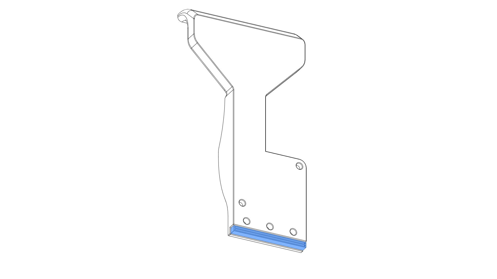
- 2 Piece Version:
  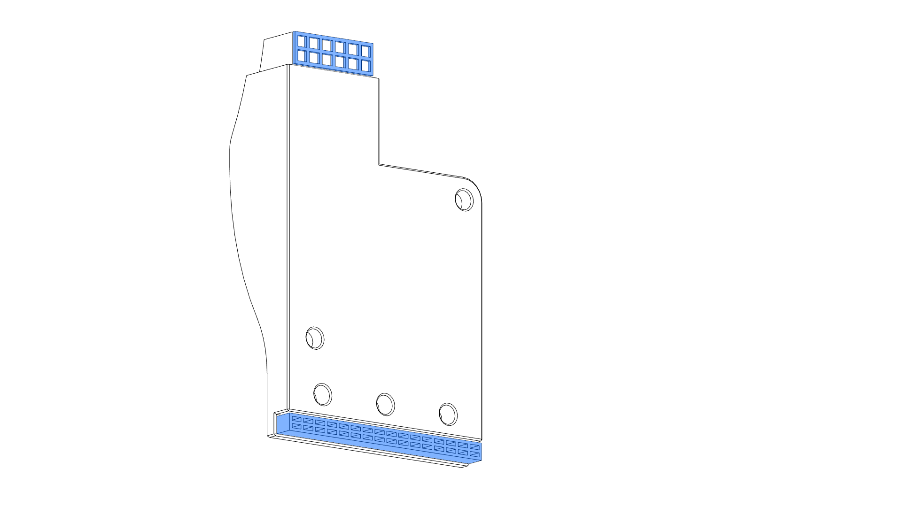

#### Insert 2x Heatsets For the fan from the front. **CAUTION** the printed part is 5mm thick, so the Heatset is exactly the same length as the part. Don't push the Heatset through by accident.

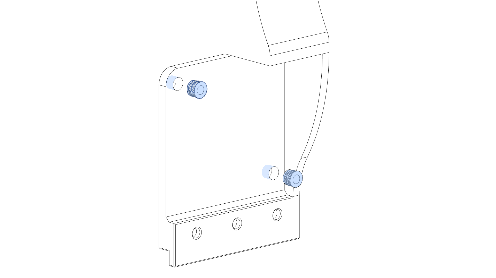

#### Insert 3x Heatsets for the clamping-block into the shroud from the back.

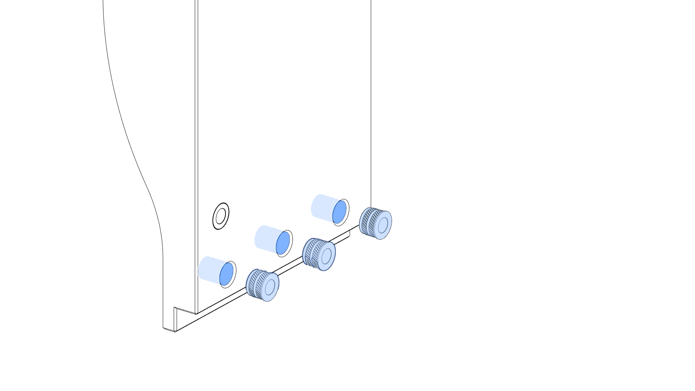

#### 2 Piece Version only: Apply Glue to the outside surfaces of the bottom part duct and glue the two pieces together.

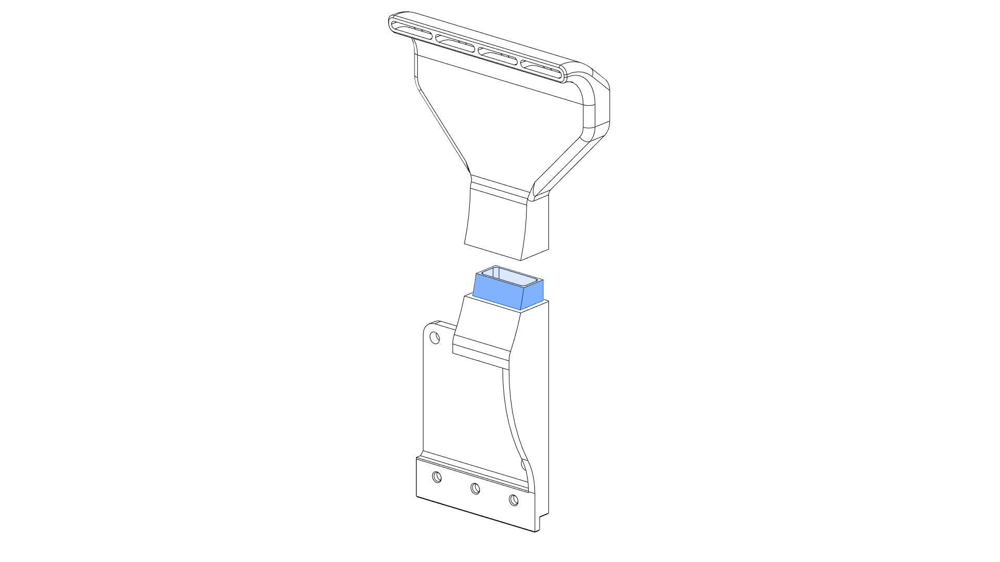

#### Install Fan into shroud and secure with 2x M3x18 BHCS and one Washer each.

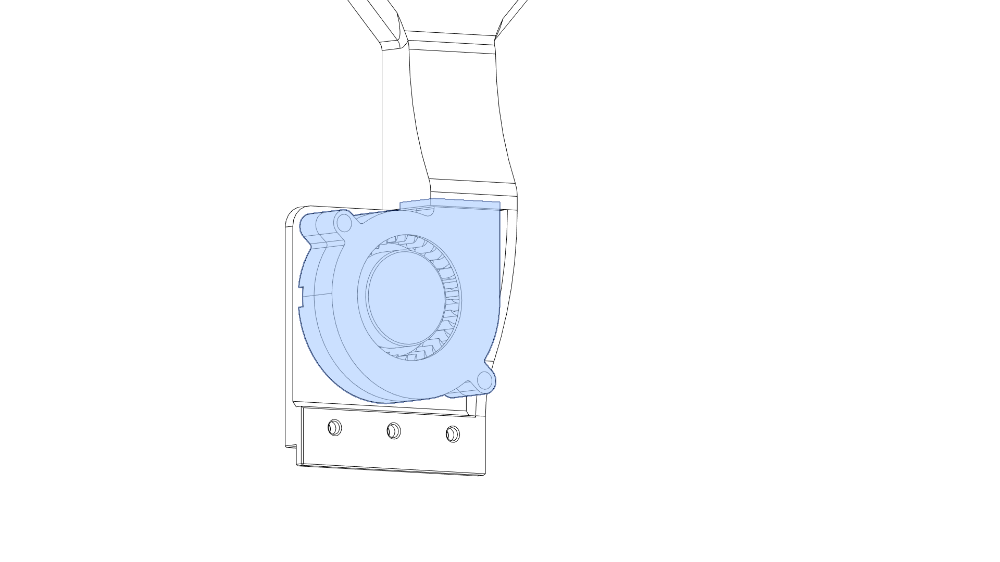
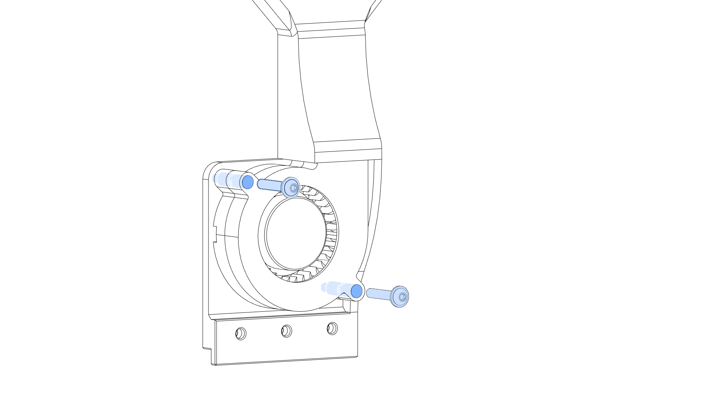

#### Slide the shroud into the frame on whichever side you prefer.

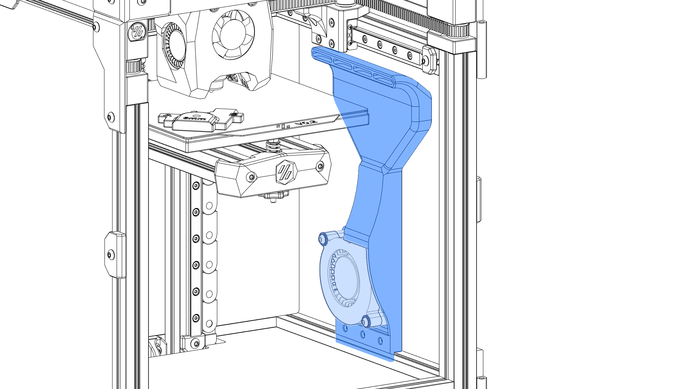

#### Attach the clamp-block with 3x M3x16 BHCS and clamp the shroud to the bottom extrusion. **Afterwards check that your Toolhead does not collide with the Shroud when it's all the way to the right!**

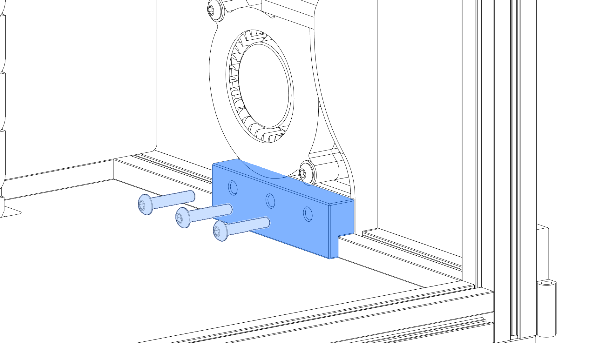

#### You can route the fan wires through the top slot of the extrusion past the electronics panel to the electronics compartment and hook up the fan.

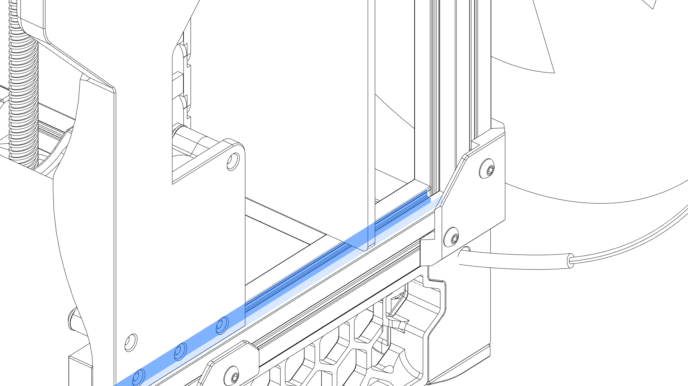

## Klipper Configuration

All the values for the settings are what works for me with a GDSTIME 24V Dual Ball Bearing Fan. You might need to adjust these for your setup.

Copy the included `aux_fan.cfg` to your klipper config folder and add `[include aux_fan.cfg]` to your `printer.cfg`.

Edit the `aux_fan.cfg` and replace the `PIN` in the `[fan_generic Aux_Fan]` section with the pin you have your fan connected to.

### Example: Fan connected to the Fan 3 Port (PB7) on an Mellow Fly E3 Pro v3:

```
...
[fan_generic Aux_Fan]
pin: PB7
...
```

### Example: Fan controlled with MOSFET connected to GPIO13 on your Raspberry Pi and your Pi is configured in klipper with a `[mcu host]` section:

```
...
[fan_generic Aux_Fan]
pin: host:gpiochip0/gpio13
...
```

## Controlling the Fan

### Manual

After you have added the configuration to your klipper instance and reloaded klipper you should be able to control the fan using `SET_FAN_SPEED FAN=Aux_Fan SPEED=XX` where `XX` is a (decimal-) number between 0 and 1 (1 being 100%, 0.5 = 50% and so on).

If you are using Mainsail or Fluidd you should see an `Aux Fan` Slider right under the normal Partcooling-fan control, with which you can also set the fan speed.


### Slicer

There is no widespread support for auxilliary cooling fans in slicers.
The only one i know of is [BambuStudio](https://github.com/bambulab/BambuStudio) and its Forks (e.g. [BambuStudio - SoftFever](https://github.com/SoftFever/BambuStudio-SoftFever)). The way BambuStudio controls the auxilliary cooling fan is by sending a `M106 P2 Sxxx`, where `xxx` is the speed on a scale of 0 to 255. If we check the Marlin Documentation we see that `P2` selects the fan with index number 2 to set the speed, however klipper does not support a index selection with `M106`, at least as far as i know.

I have included a basic replacement Macro for `M106` in the `aux_fan.cfg`, which checks if the `P2` variable exists and then sets the auxilliary cooling fan speed. If there is no `P2` variable the default partcooling fan gets set instead.

Also included is a `M107` replacement that just stops the auxilliary fan when a `P2` exists, else both partcooling and auxilliary fan get stopped.

Be sure to add a ``M107`` or ``M106 P2 S0`` to either your ``PRINT_END``-macro or in the end-gcode of your slicer to make sure that the auxilliary fan and partcooling fan stops. Often there is only an ``M106 S0`` executed at the end, which only turns off the partcooling fan but not the Auxilliary fan.


## Vibrations
Because the shroud leans against the outside panel there could be some unwanted vibration noises. To lessen this you could add a bit of foam tape to the back of the shroud, however use thin foam tape to avoid the shroud leaning forward into the movement area of your toolhead.