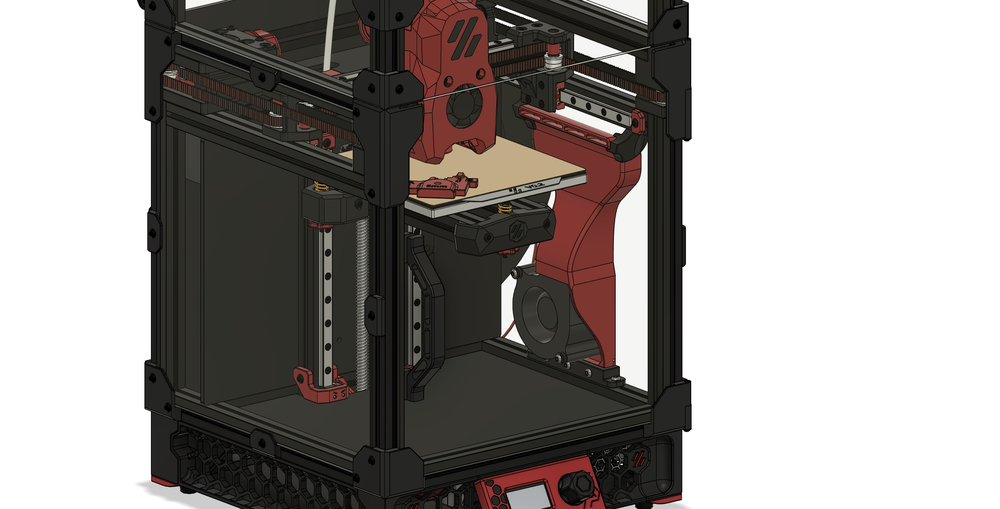

# V0 Auxilliary Cooling Fan

Auxilliary Cooling Fan Ducts for the Voron V0 3d-Printers, using either a 5015, 6028, 7530, 9733 or 12032 Blower Fan.

Below the 6028 Fan and duct installed in a v0.2 using the screw mounts.

The ducts can be easily installed after the Printer has already been fully assembled, as there are mounting options that don't require preloaded nuts in the extrusion slots.

Since the [R1 release](#2023-08-15-R1-Release) there are now 3 mounting options:

1. (Legacy) Clamp-Mount: this one just clamps the duct to the bottom extrusion. This was a easy way to secure the ducts, however the ducts were prone to come loose from vibrations and could tilt into the print volume, colliding with the toolhead. This version is no longer recommended.
2. Screw-Mounts to secure the bottom and top of the ducts to the frame. These allow the most secure installation, however you will need preloaded M3 nuts in the slots of the extrusion (2 at the bottom and 2 at the top). Due to space constraints installing these Mounts (especially the top ones) can be rather difficult on the larger fan ducts with the frame assembled.
3. Twist-Mounts that get inserted into the extrusion slot and twisted 90° to secure to the frame. These provide a very solid mount while not needing preloaded M3 nuts and therefore are the recommended installation method for already fully assembled printers. If these are to tight or to loose after installation you can adjust the CAD-Files to improve the mount, a [guide is provided in the docs folder](docs/CAD_Twist_Tightness.md).

All of these mounting options use the same main duct bodies, so you could also mix and match as you want. For Example if you used a Nevermore filter before you could use the 2 M3 nuts in the bottom extrusion to secure the bottom of the duct with a screw mount and the top with the twist mounts.

**No matter what mount you choose it is highly recommended you use one of the top mounts to ensure propper alignment towards the print bed and avoid the duct to collide with the toolhead.**

The ducts come in 2 Versions: A Unibody Version for which you'll need a larger Printer as it is 170mm long and a 2 Piece Version which you can print on a V0 and glue together after printing.

I have not done any CFD-Simulation on these shrouds, so they definitely could be better.

Currently there are ducts for the following Blower Fan sizes available:

- [50x15mm](/ducts/5015/)
- [60x28mm](/ducts/6028/)
- [75x30mm](/ducts/7530/)
- [97x33mm](/ducts/9733/)
- [120x32mm](/ducts/12032/)

There also are ducts that target their airflow 3mm lower than the MiniSB for people using higher flow toolheads where the nozzle sits slightly lower in the [UHF Folder](ducts/_UHF/)

### Warning

There seems to be quite a bit of variance in the exact mounting hole patterns on these blower fans, especially the larger ones. So you could run into compatibility issues and need to adjust the model in CAD. I used GDSTIME fans for all my tests so these should work.

### Overhang Test

For Comparision Pictures of the cooling Performance check the [Overhang Tests](/docs/OverhangTests.md) Document. These are currently outdated as they use the old ducts from before the R1 Release.

## Print Settings

As these parts don't hold any high loads you don't have to print these according to the Voron Guidelines. 3 Perimeters with 25% Infill are more than enough.

## Stuff to keep in mind

### Connecting the fan

You'll need a way to connect the fan, there are a few ways to do this outlined in the [Connecting the fan](/docs/connecting_fan.md) documentation.

### Shroud Clearance

If you have LEDs or a Camera mounted to the underside of the Y-axis extrusions these will likely collide with the fanshroud so you might need to move the LEDs to the top.

## BOM

Depending on your choice of mount and fan the BOM changes. The parts for the mounts are the same, regardless of fan:
| Part | Quantity | Notes |
| --------------------- | -------- | -------------------------------------------------- |
| M3x5x4 Heatset Insert | 3 | for all mounts |
| M3x16 BHCS | 3 | for clamp mount |
| M3x12 BHCS | 2 | for screw and twist mount |
| M3x8 BHCS | 2 | for bottom screw mount |
| M3x6 BHCS | 2 | for top screw mount |
| Superglue | | only if using a 2 piece duct |
| VHB-Tape | | for top mounts |

BHCS can be substituted for SHCS.

Additionally you will need some Hardware to secure the fan. See the specific README of each version for a list of additionally required parts.

## Assembly instructions

Refer to the [General Assembly Instrucions](/docs/general_assembly.md) documentation and the additional information in the README of each specific duct.

## Firmware Configuration

There are example klipper configs with macros and display entries provided. These allow easy control of the fan and even Slicers like BambuStudio or OrcaSlicer to control the fan with G-Code.

Refer to the [Firmware and Slicer Configuration](/docs/firmware_slicer.md) documentation.

## Credits

Thanks to the Voron Team for their great work on the V0 Printer: [Voron Design](https://vorondesign.com/voron0.2)

Following Fan Models were used in CAD:

- [Radial Cooling 5015 Fan (50mm) DC12V](https://grabcad.com/library/radial-cooling-5015-fan-50mm-dc12v-1) by
  Aleksandr Ivanov
- [Basic 6028 Blower Model](https://www.thingiverse.com/thing:4270101) by kelvinA
- [Gamma 28 Blower Fan 76×30mm](https://grabcad.com/library/gamma-28-blower-fan-76x30mm-1) by Pokai Chang
- [CBM-979433S-125-467](https://www.cuidevices.com/product/thermal-management/dc-fans/centrifugal-blowers/cbm-979433s-125-467) by CUI Devices
- [CBM-A232B-120-457](https://www.cuidevices.com/product/thermal-management/dc-fans/centrifugal-blowers/cbm-a232b-120-457) by CUI Devices

## Changelog

### 2023-08-25
- Add experimental 5015 & 6028 duct with clearance for klicky probes

### 2023-08-15 R1 Release

- Remade all ducts to make CAD cleaner, wallthicknesses more consistent and the design more consistent overall
- Adjusted ducts to reduce back pressure and improve overall cooling performance (12032 Version seems to still have a bit of a backpressure issue, but is far better than the old design).
- Increased thickness of bottom bar that slots into the extrusion for more rigid mount. Tolerances of these slots are quite big, so on some frames it could get tight.
- Added Cable-Channels to rear for tidier wire routing
- Added Screw-Mounts for the bottom and the top of the ducts (Require preloaded M3 nuts)
- Added "Twist"-Mounts for the bottom and the top of the ducts
- Improvements to Supports, resulting in better print results. However these are slightly harder to remove.
- In addition to STEP Files I also exported the source Fusion 360 Files, allowing for easier Modification and understanding of how these ducts were created.
- Updated Documentation to reflect these changes
- Added links to the used CAD-Files for the fans

Changes made to ducts to improve cooling performance:

- 6028: Duct Outlet is now 85mm wide (before 80mm)
- 7530: Duct Outlet is 90mm wide and 3.5mm high (before 80mm and 3mm respectively)
- 9733: Duct Outlet is 100mm wide and 4mm high (before 80mm and 3mm respectively)
- 12032: Duct Outlet is 110mm wide and 5mm high (before 90mm and 3mm respectively)

All had slight changes to the internal flow guide geometry to (hopefully) improve cooling performance.

Known Issue: The 7530 duct still has higher airflow at the left side than on the right side, at least at 100% speed. Will need to rework the internal flow guides some time in the future. 

### 2023-06-24

- Add centered Top Part for the 12032 Duct for better alignment when installed on the left side of the printer. Deprecated old version.
