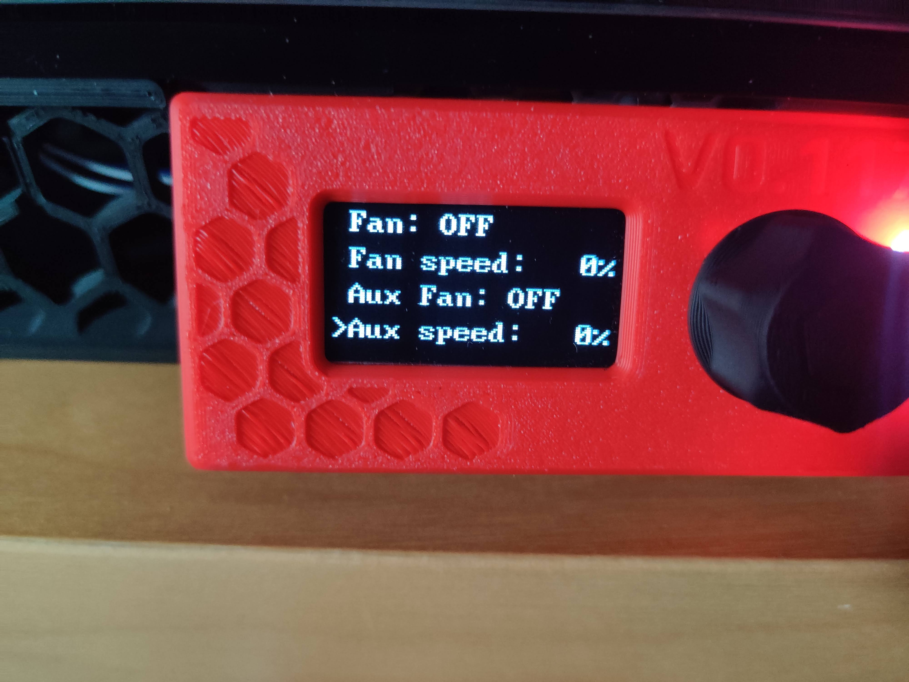
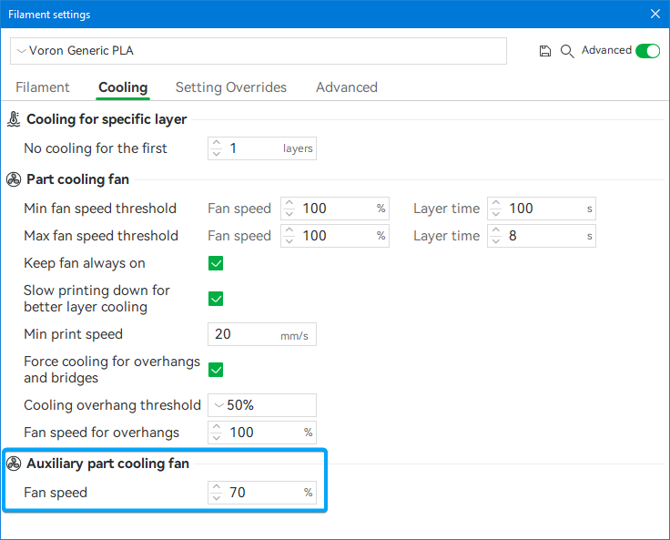
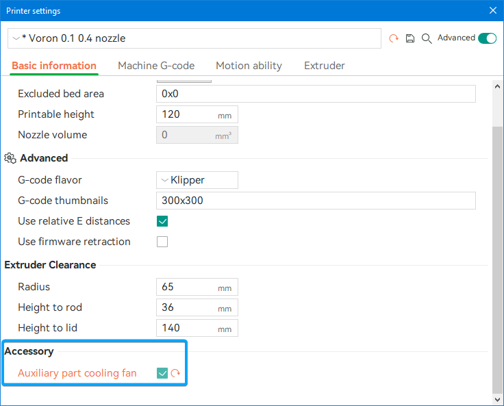
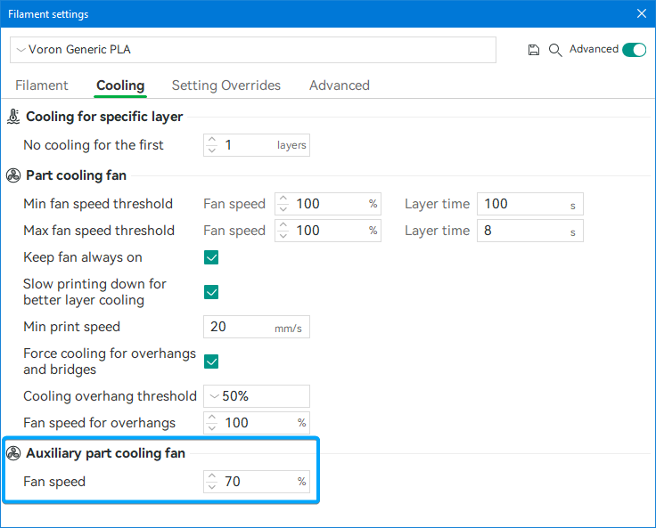

# V0 Auxilliary Cooling Fan

Auxilliary Cooling Fan Ducts for the Voron V0 3d-Printers, using either a 5015, 6028, 7530, 9733 or 12032 Blower Fan.


Below the 5015 Fan and duct installed in a v0.2


The Shrouds can be easily installed after the Printer has already been fully assembled, as they just slot into either the left or right bottom extrusion and get clamped onto the extrusion. For added security you can use some VHB-Tape.

The Shrouds come in 2 Versions: A Unibody Version for which you'll need a larger Printer as it is 170mm long and a 2 Piece Version which you can print on a V0 and glue together after printing.

I have not done any CFD-Simulation on these shrouds, so they definitely could be better.

Currently there are ducts for the following Blower Fan sizes available:

- [50x15mm](ducts/5015/)
- [60x28mm](ducts/6028/)
- [75x30mm](ducts/7530/)
- [97x33mm](ducts/9733/)
- [120x32mm](ducts/12032/)

### Warning

There seems to be quite a bit of variance in the exact mounting hole patterns on these blower fans, especially the larger ones. So you could run into compatibility issues and need to adjust the model in CAD. I used GDSTIME fans for all my tests so these should work.

### Overhang Test

For Comparision Pictures of the cooling Performance check the [Overhang Tests](OverhangTests.md) Document.

## Print Settings

As these parts don't hold any high loads you don't have to print these according to the Voron Guidelines. 3 Perimeters with 25% Infill are more than enough.

## Stuff to keep in mind

### Connecting the fan

You'll need a way to connect the fan, there are a few ways to do this:

#### MCU with enough fan ports

The easiest way would be to use a Fan-Port on your MCU, however most MCUs are already completely occupied by the Hotend-, Partcooling- and Controller-Fan. So you would need a MCU with more Fan-Ports, like the [Mellow Fly E3 Pro v3](https://www.aliexpress.com/item/1005002372751834.html) which has 4 Fan-Ports while having the same footprint as an Ender 3 Board (like BTT SKR E3).

#### Additional MCU

Because Klipper supports multiple MCUs you could add another MCU however this one would need to be very small to fit the electronics compartmens of the V0. One option would be [Timmit's Klipper Expander](https://github.com/VoronDesign/Voron-Hardware/tree/master/Klipper_Expander) over on the Voron-Hardware Github.

#### CAN-Bus Toolhead Board

By using a CAN-Bus Toolhead board you are freeing up 2 Fan-Ports on your main mcu, because your hotend and partcooling fan are now connected to the CAN-Board. This would allow you to connect your auxilliary fan to the mcu.

#### Raspberry Pi GPIO-Pin with Transistor/MOSFET

Alternatively you can run the fan of a GPIO-Pin of your Pi by using a Transistor or MOSFET. There are quite a few guides online on how to do this, like [this one from SENSORSIOT](https://www.sensorsiot.org/variable-speed-cooling-fan-for-raspberry-pi-using-pwm-video138/). You can ignore the Python-Script, as we will control the fan through Klipper (see [Klipper Configuration](#klipper-configuration)). The IRLZ44N MOSFET has worked fine for me for both 5V and 24V Fans.

### Shroud Clearance

If you have LEDs or a Camera mounted to the underside of the Y-axis extrusions these will likely collide with the fanshroud so you might need to move the LEDs to the top.

## BOM

See the specific README of each version for a list of required parts.

## Klipper Configuration

All the values for the settings are what works for me with a GDSTIME 24V Dual Ball Bearing Fan. You might need to adjust these for your setup.

Copy the included `aux_fan.cfg` to your klipper config folder and add `[include aux_fan.cfg]` to your `printer.cfg`.

Edit the `aux_fan.cfg` and replace the `PIN` in the `[fan_generic Aux_Fan]` section with the pin you have your fan connected to.

Klipper does not support controlling aditional fans with `M106` and `M107` by default, so i added some replacement Macros wich include a selection parameter `P` kinda like [Marlin](https://marlinfw.org/docs/gcode/M106.html) does. Index 2 gets matched to the Auxilliary cooling fan, because that is how BambuStudio controlls the auxilliary cooling fan.

Be sure to add a `M107` or `M106 P2 S0` to either your `PRINT_END`-macro or in the end-gcode of your slicer to make sure that the auxilliary fan and partcooling fan stops. Often there is only an `M106 S0` executed at the end, which only turns off the partcooling fan but not the Auxilliary fan.

The `aux_fan.cfg` also adds Controls for the auxilliary fan to the Display in the `Control` Menu, so you can also control the fan with an V0-Display.
These new controls should appear right beneath the partcooling fan inputs, if they don't you might need to adjust the `index` value in `aux_fan.cfg`.


### Config-Example: Fan connected to the Fan 3 Port (PB7) on an Mellow Fly E3 Pro v3:

```
...
[fan_generic Aux_Fan]
pin: PB7
...
```

### Config-Example: Fan controlled with MOSFET connected to GPIO13 on your Raspberry Pi and your Pi is configured in klipper with a `[mcu host]` section:

```
...
[fan_generic Aux_Fan]
pin: host:gpiochip0/gpio13
...
```

## Controlling the Fan

### Manual

After you have added the configuration to your klipper instance and reloaded klipper you should be able to control the fan using `SET_FAN_SPEED FAN=Aux_Fan SPEED=XX` where `XX` is a (decimal-) number between 0 and 1 (1 being 100%, 0.5 = 50% and so on).

If you are using Mainsail or Fluidd you should see an `Aux Fan` Slider right under the normal Partcooling-fan control, with which you can also set the fan speed.


### Slicer

There is no widespread support for auxilliary cooling fans in slicers.
The only one i know of is [BambuStudio](https://github.com/bambulab/BambuStudio) and its Forks (e.g. [OrcaSlicer](https://github.com/SoftFever/OrcaSlicer)). The way BambuStudio controls the auxilliary cooling fan is by sending a `M106 P2 Sxxx`, where `xxx` is the speed on a scale of 0 to 255. That is why there is a included Macro for Klipper that allows this G-Code to function with klipper.

#### BambuStudio

In the `Filament settings` window in the `Cooling section` set the auxilliary Cooling fan speed to what you want. This will enable the fan to the set speed after the first layers where the partcooling fan is disabled.


#### OrcaSlicer

In the `Printer settings` under `Basic inormation` enable the `Auxilliary part cooling fan` setting. Then in the `Filament settings` set the fan speed to your wanted speed (like with standard BambuStudio).



## Vibrations

Because the shroud leans against the outside panel there could be some unwanted vibration noises. To lessen this you could add a bit of foam tape to the back of the shroud, however use thin foam tape to avoid the shroud leaning forward into the movement area of your toolhead.
