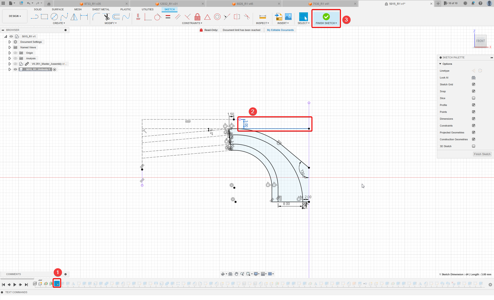

# Adjusting the Height of the ducts
If you need a different height for the ducts, because you have a different length toolhead installed, or you just want to play around with the geometry of the outlets you can import the f3z CAD file to Fusion360 and by just editing one sketch achieve your goal.

## 1. Import the f3z CAD-File
Select `File > Open...` select the duct you wish to edit and upload it to Fusion360. This will take a little bit of time. Then Open the Project File.
## 2. Select the first Sketch in the timeline and edit it
To adjust the height of the Outlet change the highlighted 3mm dimension. 3mm is the value to target the nozzleheight of the Mini StealthBurner. So if you're nozzle is for example 2.5mm lower you'll have to add this to the 3mm: 3mm+2.5mm=5.5mm is the new Dimension you want to enter here. Afterwards click finish Sketch and wait for Fusion to do all of the calculations.

## 3. Afterwards you might get some Warnings or Errors pop up at the bottom right
Generally the Yellow Warnings can just be ignored. These often come from some edges on chamgers/fillets getting combined and not needing a chamfer anymore.

If you get a red Error you will have to check in the timeline what operation is causing the Error. These usually also come from chamfers or fillets, these can most of the time be fixed by deselecting the edges in question.

## 4. Export the Bodies/Components
Now Export the parts that you need as STLs.

**Important** For the ducts export the components that contain the support structures as **one file** as otherwise the supports will be missing after the export.