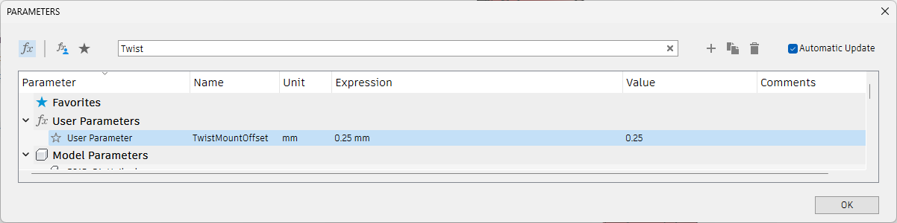
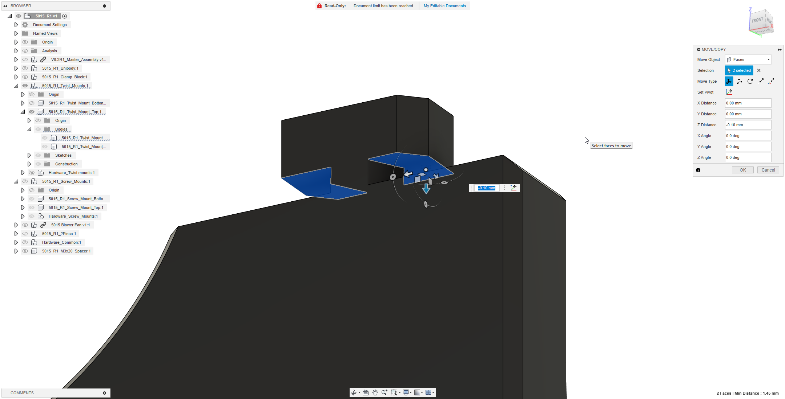

# Adjusting Twist Mount Tightness in CAD
There are 2 basic ways to adjust the tightness of the twist mount:
## 1: Adjusting the Parameter in Fusion360
How much the twist mounts press on the extrusion is controlled with a Parameter in Fusion360. So if you import the f3z CAD file you only need to got to `Modify > Change Parameters` and search for `Twist` and edit the value. decreasing it makes the grip looser, increasing it makes it tighter.

## 2: Manually moving the faces of the contact of the Twist mounts
This should work in basically all CAD software. Import the STEP File then isolate the Twist Mount Component.
Select the faces of the T-Bar that contact the extrusion and move the faces to adjust the tightness of the mount. Repeat this for all 4 of the twist mounts.

## After adjusting export the mount files as STL and print