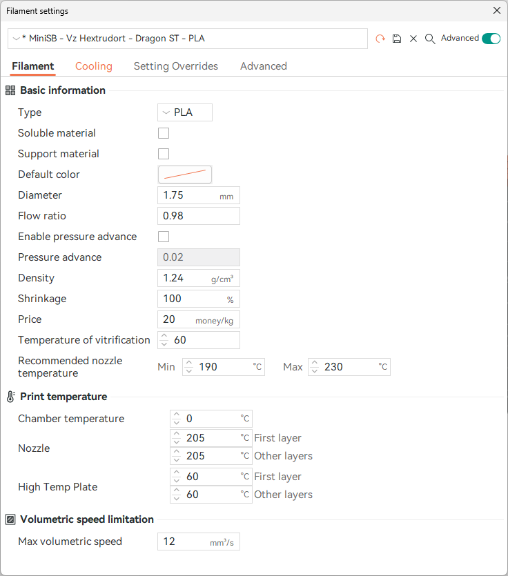

# Overhang Test (05-2023)
**This Test is currently outdated, as I have not retested with the new R1 Ducts**
- Test File: [Overhang Test by tomi3d](https://www.printables.com/model/126029-overhang-test)
- Filament: PLA - [Redline Filament Yellow](https://www.redline-filament.com/collections/pla-filament/products/premium-pla-gelb)
- Printer: V0.2 with original (Pre r1) Mini-Stealthburner. Enclosure on, Door open, Tophat closed
- Auxiliary Fan was installed on the right side of the printer
- Sliced with OrcaSlicer, same G-Code for all prints only the fan was swapped out or unplugged. Partcooling and Auxiliary Fan were set to 100% after the 3rd layer. Settings are at the [end of this document](#print-settings)

## Results
TL;DR: Bigger Fan means better cooling. The 75x30mm Blower fan seems to be a reasonable choice.

Most of the prints got knocked off the build plate or partially broken because of the severe curling at steeper overhangs. The only one that managed to print fully was the one with the 120x32mm fan. However, as the sample size for each fan was only one print this might have been luck.

With increasing fan size and so with higher air flow the overhangs get cleaner. However, towards the higher end the difference gets quite small, the 120 mm and 97 mm fan almost perform the same in this test.

Also, notable is the fact that the Mini-Stealthburner severely struggles with cooling faces/overhangs that face towards the rear of the printer. This Area is improved quite significantly with the airflow of the larger fans.

Overall I would say the 75x30mm fan provides a good enough performance for the build volume of a V0. Everything bigger seems overkill for "reasonable" print speeds, however if you want to push your printer to the absolute maximum (shoutout [247printing](https://www.youtube.com/watch?v=IRUQBTPgon4)) you probably want to go all the way to the 120 mm one.

The 50x15mm fan doesn't perform very well, however it still improves the overhang-performance by around 10° and chances are generally quite high that 3d-printer builders have some of these lying around already, so you might just try it. Also, there have been some people putting one fan on each side of the printer and being quite happy with the improved cooling, however I have not tested this configuration yet. 
### No Fan
Popped of the bed in the middle of 60°.

### 5015 Fan
Tested Fan: [GDSTIME 5015 24V Dual Ball Bearing Blower Fan](https://www.aliexpress.com/item/32865977791.html)

Arc facing to the left snapped off at the beginning of 70°, the rest printed successfully. The broken arc was glued back on for easier comparison pictures.

### 6028 Fan
Tested Fan: [GDSTIME 6028 24V Dual Ball Bearing Blower Fan](https://www.aliexpress.com/item/1005003792895461.html)

Popped of the bed and snapped of the rear facing arc at the beginning of 70°. The broken arc was glued back on for easier comparison pictures.

### 7530 Fan
Tested Fan: [GDSTIME 7530 24V Dual Ball Bearing Blower Fan](https://www.aliexpress.com/item/1005002663971820.html)

Popped of the bed and snapped of the left facing arc at the beginning of 60°. The broken arc was glued back on for easier comparison pictures.

While this print failed before most of the others the overhangs look quite a bit better than the ones of the smaller fans.

### 9733 Fan
Tested Fan: [GDSTIME 9733 24V Dual Ball Bearing Blower Fan](https://www.aliexpress.com/item/32622626365.html)

Popped of the bed and snapped of the rear facing arc at the beginning of 70°. The broken arc was glued back on for easier comparison pictures.

### 12032 Fan
Tested Fan: [GDSTIME 12032 24V Dual Ball Bearing Blower Fan](https://www.aliexpress.com/item/1005005288258849.html)

Managed to print all the way without a catastrophic failure.

## Print Settings
The following Settings were used in OrcaSlicer to generate the G-Code

