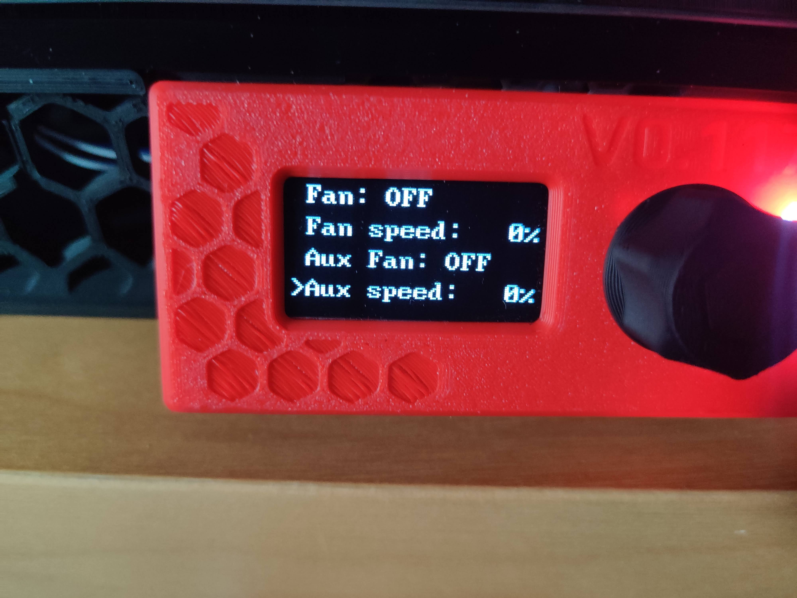
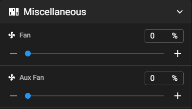
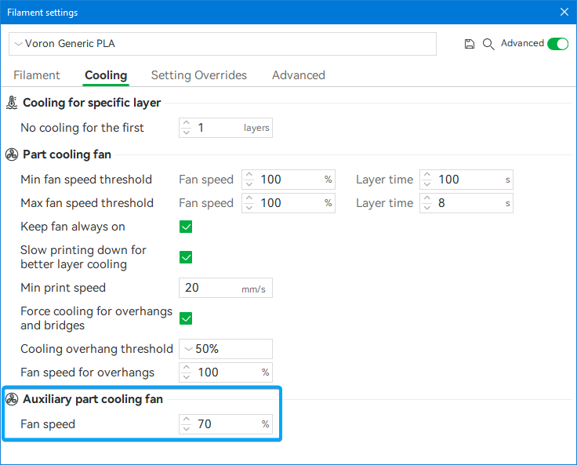
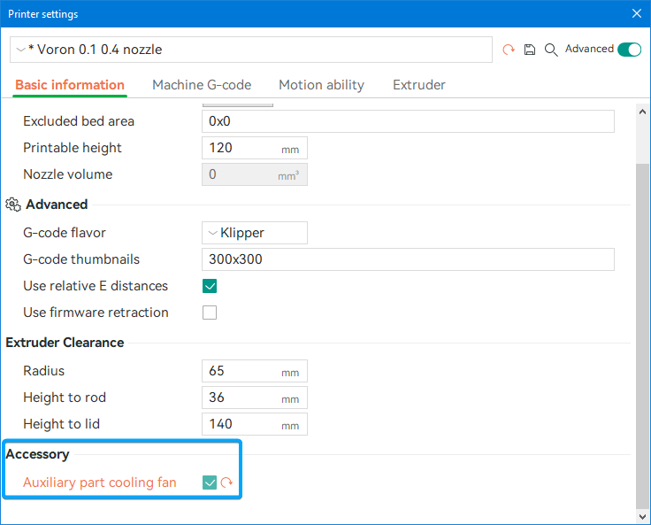
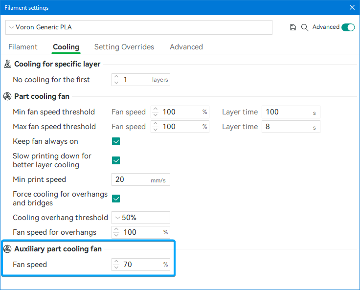

# Firmware and Slicer Configuration
## Klipper Configuration

All the values for the settings are what works for me with a GDSTIME 24V Dual Ball Bearing Fan. You might need to adjust these for your setup.

Copy the included `aux_fan.cfg` from the [firmware folder](/firmware/) to your klipper config folder and add `[include aux_fan.cfg]` to your `printer.cfg`.

Edit the `aux_fan.cfg` and replace the `PIN` in the `[fan_generic Aux_Fan]` section with the pin you have your fan connected to.

Klipper does not support controlling additional fans with `M106` and `M107` by default, so I added some replacement Macros which include a selection parameter `P` kinda like [Marlin](https://marlinfw.org/docs/gcode/M106.html) does. Index 2 gets matched to the Auxiliary cooling fan, because that is how BambuStudio and its forks (e.g. OrcaSlicer) control the auxiliary cooling fan.

Be sure to add a `M107` or `M106 P2 S0` to either your `PRINT_END`-macro or in the end-gcode of your slicer to make sure that the auxiliary fan and partcooling fan stops. Often there is only a `M106 S0` executed at the end, which only turns off the partcooling fan but not the Auxiliary fan.

The `aux_fan.cfg` also adds Controls for the auxiliary fan to the Display in the `Control` Menu, so you can also control the fan with an V0-Display.
These new controls should appear right beneath the partcooling fan inputs, if they don't, you might need to adjust the `index` value in `aux_fan.cfg`.


### Config-Example: Fan connected to the Fan 3 Port (PB7) on a Mellow Fly E3 Pro v3:

```
...
[fan_generic Aux_Fan]
pin: PB7
...
```

### Config-Example: Fan controlled with MOSFET connected to GPIO13 on your Raspberry Pi and your Pi is configured in klipper with a `[mcu host]` section:

```
...
[fan_generic Aux_Fan]
pin: host:gpiochip0/gpio13
...
```

## Controlling the Fan

### Manual

After you have added the configuration to your klipper instance and reloaded klipper you should be able to control the fan using `SET_FAN_SPEED FAN=Aux_Fan SPEED=XX` where `XX` is a (decimal-) number between 0 and 1 (1 being 100%, 0.5 = 50% and so on).

If you are using Mainsail or Fluidd you should see a `Aux Fan` Slider right under the normal Partcooling-fan control, with which you can also set the fan speed.



### Slicer

There is no widespread support for auxiliary cooling fans in slicers.
The only one I know of is [BambuStudio](https://github.com/bambulab/BambuStudio) and its Forks (e.g. [OrcaSlicer](https://github.com/SoftFever/OrcaSlicer)). The way BambuStudio controls the auxiliary cooling fan is by sending a `M106 P2 Sxxx`, where `xxx` is the speed on a scale of 0 to 255. That is why there is an included Macro for Klipper that allows this G-Code to function with klipper.

#### BambuStudio

In the `Filament settings` window in the `Cooling section` set the auxiliary Cooling fan speed to what you want. This will enable the fan to the set speed after the first layers where the partcooling fan is disabled.


#### OrcaSlicer

In the `Printer settings` under `Basic inormation` enable the `Auxilliary part cooling fan` setting. Then in the `Filament settings` set the fan speed to your wanted speed (like with standard BambuStudio).


