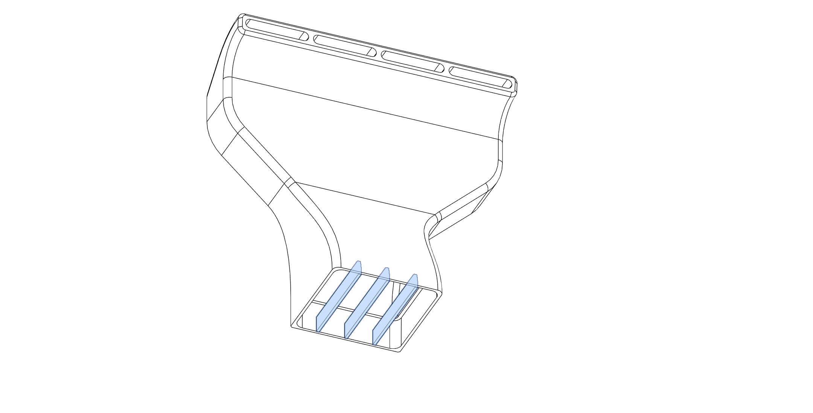

# General Assembly Instructions

These Instructions will guide you through the installation process. The assembly process is pretty much the same for all versions, however see the README of your specific duct for additional Information like screw length.

- [50x15mm README](/ducts/5015/README.md)
- [60x28mm README](/ducts/6028/README.md)
- [75x30mm README](/ducts/7530/README.md)
- [97x33mm README](/ducts/9733/README.md)
- [120x32mm README](/ducts/12032/README.md)

## Assembly Instructions

### 1. Remove the built-in Supports

#### On the 5015 and 6028 2 Piece Variant you will need to remove some extra supports

### 2. If you're using a 2 Piece Variant glue them together at the contact Faces

#### 5015 & 6028

#### 7530 & 9733

### 3. Insert the Heatsets for the fan from the front

### 4. Insert the Heatsets for the Mount from the back

### 5. Insert the Fan into the duct and secure with the fan screws, washer and spacer if needed. Route the wires through the Channel on the back.

### 6. Apply some VHB-Tape to the inside of the top mounts of your choice. This is mainly to stop the duct from vibrating and rattling around inside the top mounts.

### 7. Remove the side panel from your V0 for easier access and installation of the duct. This is not strictly needed, but will make installation a lot easier.

### 8. If you want to use the Top Twist mounts it is recommended to insert them now and push them to the side, so they're out of the way for the next step. Insert the Mount and turn them 90° to lock them in place. Do this for both top mounts.

### 9. Insert the duct into the bottom extrusion and align it with the center of the bed

**Tolerances:** If the fit is too tight, and you can't get the duct in the extrusion, sand the bottom part that slots into the extrusion down a bit and try again.

### 10. Secure the duct to the bottom extrusion with the mount of your choice

#### Twist Mount: Insert into the extrusion, turn 90° and push them against the duct. Secure with 3x M3x12 BHCS

#### Screw Mount: Attach the mount with 3x M3x12 BHCS to the duct and with 2x M3x8 BHCS to the Extrusion

#### Clamp Mount: Attach the clamp block to the duct with 3x M3x16 BHCS

### 11. Secure the top of the duct.

#### Twist Mount: Slide/Wiggle the Top Mounts to the duct and press them against the duct so the VHB sticks the parts together

#### Screw Mount: Attach the Mounts to the duct with the VHB Tape and secure them to the extrusion with 2 M3x6 BHCS

### 12. Route the wires through the top slot of the bottom extrusion to the electronics compartment.

### 13. [Connect the Fan](/docs/connecting_fan.md) and [configure the firmware and slicer](/docs/firmware_slicer.md).
