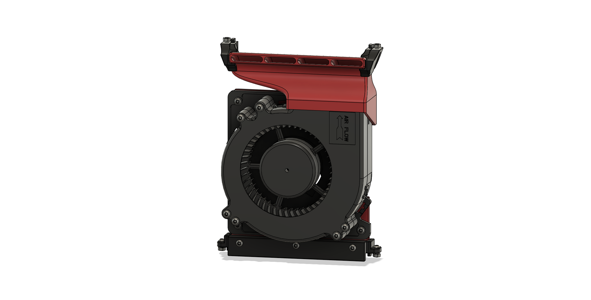

# 12032 Blower Fan Duct

## BOM

| Part                  | Quantity | Notes                                              |
| --------------------- | -------- | -------------------------------------------------- |
| M3x5x4 Heatset Insert | 12       |                                                    |
| 12032 Blower Fan      | 1        | 5V or 24V depending on your setup                  |
| M3x8 BHCS             | 3        |                                                    |
| M3x16 BHCS            | 3        |                                                    |
| M3x35 BHCS            | 6        |                                                    |
| M3 Washer             | 9        | optional, only to make better contact with the fan |
| VHB-Tape              |          | for extra mounting security if needed              |

SHCS instead of BHCS will also work.

The Fan I used was this [GDSTIME 12032 24V Dual Ball Bearing Blower Fan](https://www.aliexpress.com/item/1005005288258849.html)

## Printed Parts

You'll need to print 1 [12032_Clamp.stl](STL/12032_Clamp.stl), 1 [12032_Shroud_Bottom.stl](STL/12032_Shroud_Bottom.stl) and 1 [12032_Shroud_Top.stl](STL/12032_Shroud_Top.stl)

## Assembly Instructions

#### Remove the built-in Supports from the shroud, use some Flush-Cutters for the supports inside the ducts:

- Top:
  
- Bottom:
  

#### Insert 3x Heatsets for the fan into the top part from the front . **CAUTION** the printed part is 4mm thick, so the Heatset is exactly the same length as the part. Don't push the Heatset through by accident.

#### Insert 6x Heatsets for the fan into the bottom part from the front.

#### Insert 3x Heatsets for the clamping-block into the bottom part from the back.

#### Put the Fan into the top part and secure with 3x M3x8 BHCS and one washer each in the corners to both the top and bottom part.

#### Secure the Fan with 6x M3x35 BHCS and a washer each in the remaining mounting holes

#### Insert the shroud into the bottom extrusion of your printer and clamp it down with the clamp block and 3x M3x16BHCS. If you want add some VHB-Tape to the bottom of the shroud. For reference see the [5015 duct](/ducts/5015/README.md#slide-the-shroud-into-the-frame-on-whichever-side-you-prefer-align-it-with-the-center-of-the-print-bed) Assembly instructions
