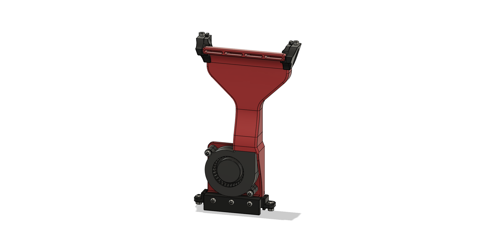

# 5015 Blower Fan Duct

## BOM

| Part                  | Quantity | Notes                                              |
| --------------------- | -------- | -------------------------------------------------- |
| M3x5x4 Heatset Insert | 5        |                                                    |
| 5015 Blower Fan       | 1        | 5V or 24V depending on your setup                  |
| M3x16 BHCS            | 3        |                                                    |
| M3x18 BHCS            | 2        |                                                    |
| M3 Washer             | 2        | optional, only to make better contact with the fan |
| Superglue             |          | only for the 2-piece shroud                        |
| VHB-Tape              |          | for extra mounting security if needed              |

SHCS instead of BHCS will also work.

The Fan I used was this [GDSTIME 5015 24V Dual Ball Bearing Blower Fan](https://www.aliexpress.com/item/32865977791.html)

## Printed Parts

You'll need to print 1 [5015_Clamp_Block.stl](STL/5015_Clamp_Block.stl) and either the [5015_Shroud_Unibody.stl](STL/5015_Shroud_Unibody.stl) if you have a large enough printer, or [5015_Shroud_2Piece_Bottom.stl](STL/5015_Shroud_2Piece_Bottom.stl) and [5015_Shroud_2Piece_Top.stl](STL/5015_Shroud_2Piece_Top.stl) if you print it on a V0-sized printer.

## Assembly Instructions

#### Remove the built-in Supports from the shroud:

- Unibody Version
  
- 2 Piece Version:
  

#### Insert 2x Heatsets For the fan from the front. **CAUTION** the printed part is 4mm thick, so the Heatset is exactly the same length as the part. Don't push the Heatset through by accident.

#### Insert 3x Heatsets for the clamping-block into the shroud from the back.

#### 2 Piece Version only: Apply Glue to the outside surfaces of the bottom part duct and glue the two pieces together.

#### Put the Fan into the shroud and secure with 2x M3x18 BHCS and one Washer each.

#### Slide the shroud into the frame on whichever side you prefer. Align it with the center of the print bed.

#### Attach the clamp-block with 3x M3x16 BHCS and clamp the shroud to the bottom extrusion. **Afterwards check that your Toolhead does not collide with the Shroud when it's all the way to the right!**

#### You can route the fan wires through the top slot of the extrusion past the electronics panel to the electronics compartment and hook up the fan.

