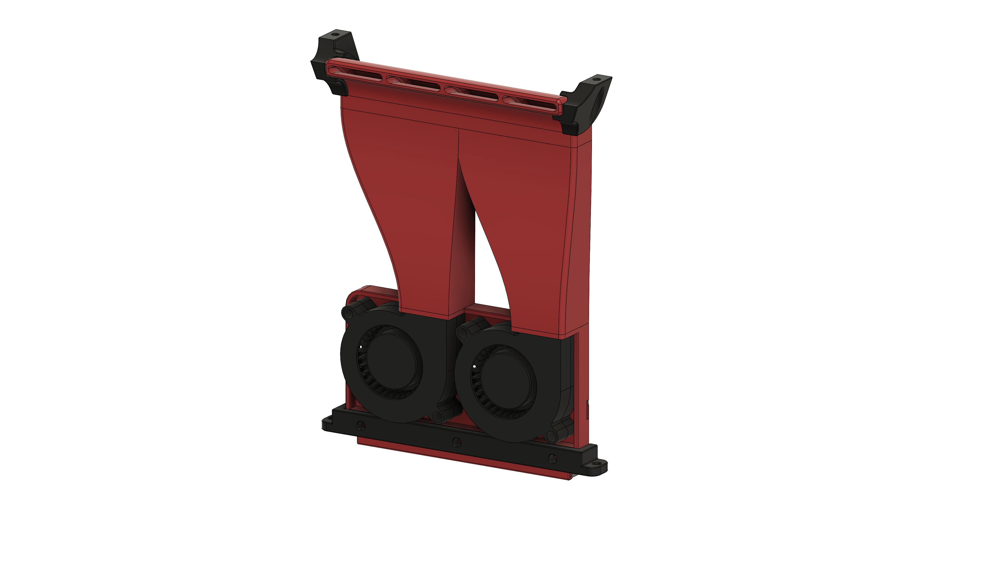

# WIP: Dual 5015 Blower Fan Duct

## WIP
**Currently this variant is untested!**

 - There is no 2 Piece variant available, so you need a large enough printer to print these parts
 - For the bottom twist mount there is only the "strong" variant available

## BOM
These parts are required in addition to the [General BOM](/README.md#bom)
| Part                  | Quantity | Notes                                                    |
| --------------------- | -------- | -------------------------------------------------------- |
| M3x5x4 Heatset Insert | 4        |                                                          |
| 5015 Blower Fan       | 2        | 5V or 24V depending on your setup                        |
| M3x20 BHCS            | 4        | M3x18 also works, then you don't need the printed spacer |
| M3 Washer             | 4        | optional, only to make better contact with the fan       |

## Printed Parts

Print the parts according to your choice of mount. If you are using M3x20 BHCS don't forget to print 2 of the spacers.

## Assembly Instructions
Follow the [General Assembly Instructions](/docs/general_assembly.md).

To secure the fans to the duct use the M3x20 BHCS with a washer and the printed spacer. Alternatively use M3x18 BHCS with a washer but without the spacer.