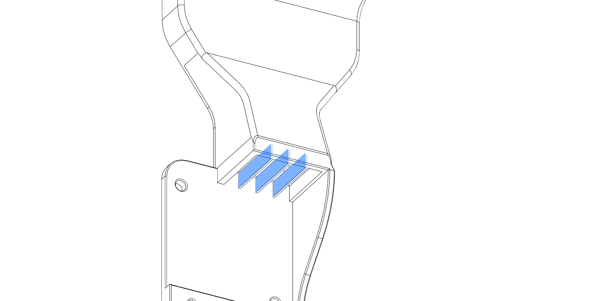
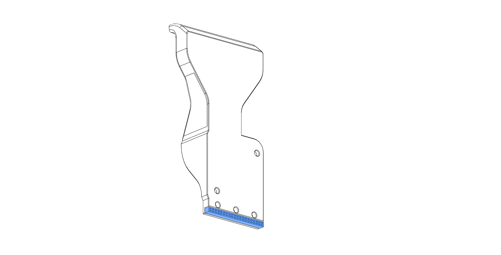
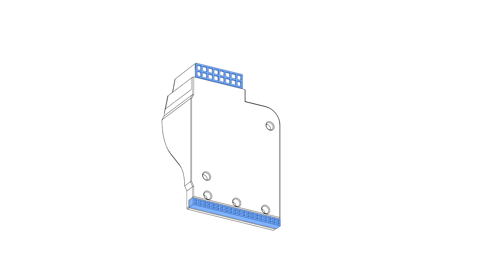
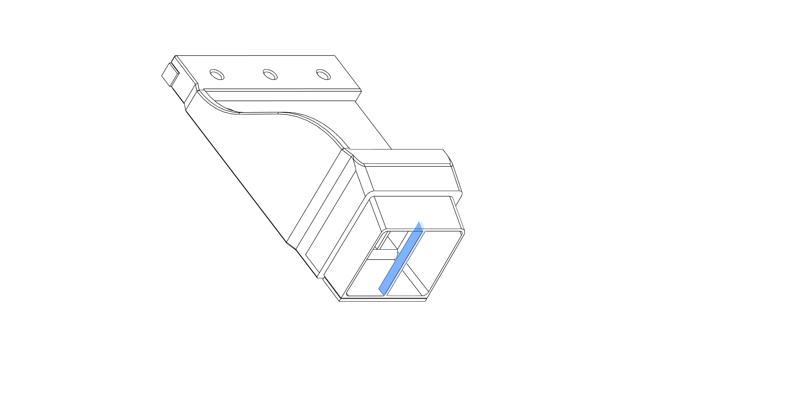
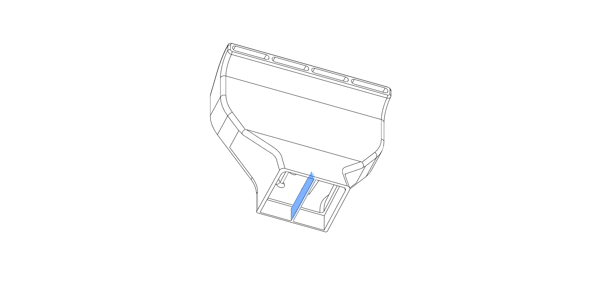
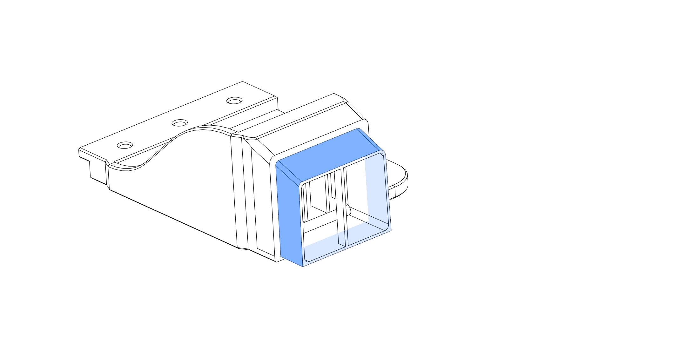

# 6028 Blower Fan Duct

## BOM

| Part                  | Quantity | Notes                                              |
| --------------------- | -------- | -------------------------------------------------- |
| M3x5x4 Heatset Insert | 5        |                                                    |
| 6028 Blower Fan       | 1        | 5V or 24V depending on your setup                  |
| M3x16 BHCS            | 3        |                                                    |
| M3x30 BHCS            | 2        |                                                    |
| M3 Washer             | 2        | optional, only to make better contact with the fan |
| Superglue             |          | only for the 2-piece shroud                        |
| VHB-Tape              |          | for extra mounting security if needed              |

SHCS instead of BHCS will also work.

The Fan I used was this [GDSTIME 6028 24V Dual Ball Bearing Blower Fan](https://www.aliexpress.com/item/1005003792895461.html)

## Printed Parts

You'll need to print 1 [6028_Clamp.stl](STL/6028_Clamp.stl) and either the [6028_Unibody_Shroud.stl](STL/6028_Unibody_Shroud.stl) if you have a large enough printer, or [6028_2Part_Shroud_Bottom.stl](STL/6028_2Part_Shroud_Bottom.stl) and [6028_2Part_Shroud_Top.stl](STL/6028_2Part_Shroud_Top.stl) if you print it on a V0-sized printer.

## Assembly Instructions

#### Remove the built-in Supports from the shroud, use some Flush-Cutters for the supports inside the ducts:

- Unibody Version
  
- 2 Piece Version:
  
  
  

#### 2 Piece Version only: Apply Glue to the outside surfaces of the bottom part duct and glue the two pieces together.

#### The remaining steps are the same as for the [5015 duct](/ducts/5015/README.md#insert-2x-heatsets-for-the-fan-from-the-front-caution-the-printed-part-is-4mm-thick-so-the-heatset-is-exactly-the-same-length-as-the-part-dont-push-the-heatset-through-by-accident), except that you use M3x30 BHCS to secure the fan.
