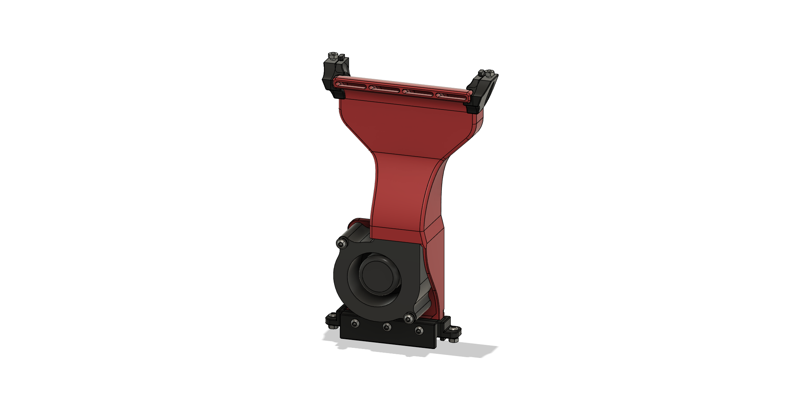

# 6028 Blower Fan Duct

## BOM
These parts are required in addition to the [General BOM](/README.md#bom)
| Part                  | Quantity | Notes                                              |
| --------------------- | -------- | -------------------------------------------------- |
| M3x5x4 Heatset Insert | 2        |                                                    |
| 6028 Blower Fan       | 1        | 5V or 24V depending on your setup                  |
| M3x35 BHCS            | 2        |                                                    |
| M3 Washer             | 2        | optional, only to make better contact with the fan |

The Fan I used was this [GDSTIME 6028 24V Dual Ball Bearing Blower Fan](https://www.aliexpress.com/item/1005003792895461.html)

## Printed Parts

Print the parts according to your choice of mount. Print 2 of the spacers for use with the M3x35 BHCS.

## Assembly Instructions
Follow the [General Assembly Instructions](/docs/general_assembly.md).

To secure the fan to the duct use the M3x35 BHCS with a washer and the printed spacer.
