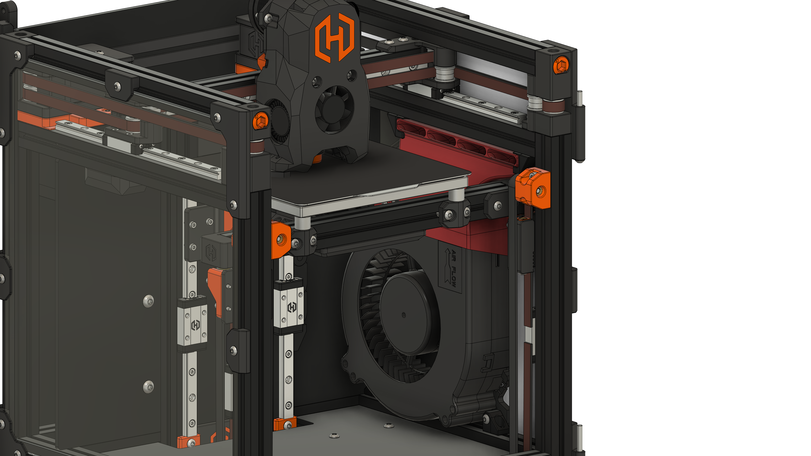
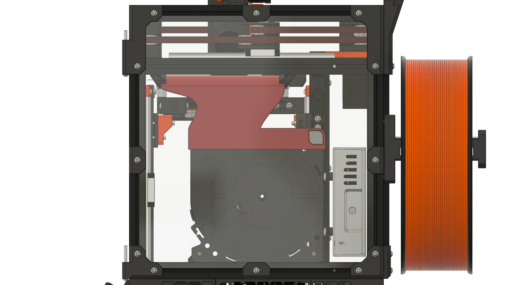

# 12032 for Hex-Zero

Custom designed duct and mount to fit the ginormous 12032 Blower fans into a Hex-Zero.

**This is currently untested.** Especially the clearance for the z-axis drag chain could be problematic, a "fixed" chain end on the rail mount is recommended to prevent the drag chain from rubbing against the fan body.
The wall thickness was also reduced to 1 mm from 2 mm to make space for the ducting, however this also means that the duct part is weaker.

All the printed parts were made specifically for the Hex-Zero and none of the original duct are reused.

Also, the way the bottom mount and duct attach to the fan has changed, you will need to install 3 Heatsets into the 3 outer mounting holes of the Blower Fan (see [Heatset Locations](#heatset-locations)).

## BOM

| Part                  | Quantity | Notes                             |
| --------------------- | -------- | --------------------------------- |
| M3x5x4 Heatset Insert | 3        |                                   |
| 12032 Blower Fan      | 1        | 5V or 24V depending on your setup |
| M3x12 BHCS            | 2        |                                   |
| M3x6 BHCS             | 1        |                                   |

If you use the screw mounts you will need a M3x6 BHCS and M3 Nut for each mounting point (4 in total, 2 for the bottom and 2 for the top mounts).

## Printed Parts
You will need to print:
- 1x 12032_R1_Hex-Zero_Right_Top
- 2x Top Mount of your choice (Screw or Twist)
- 2x Bottom Mount of your choice (Screw or Twist)

## Images

### Heatset Locations

