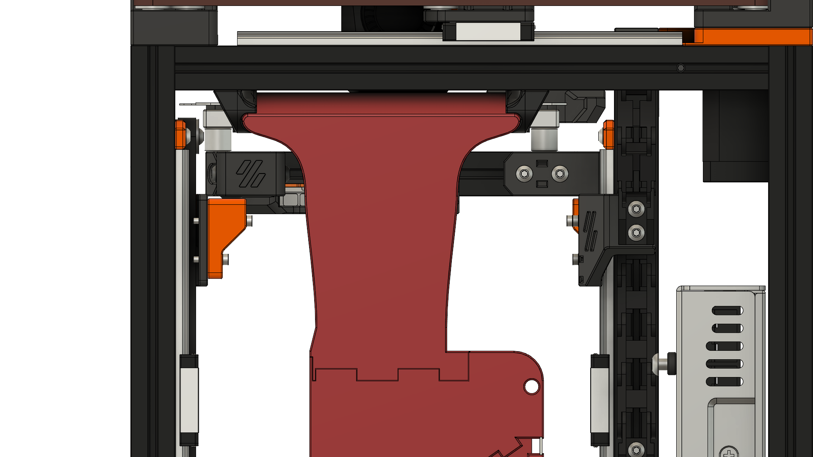

# 7530 for Hex-Zero

Custom designed duct to have the outlet at the proper height and clear the Bed Assembly.
The duct is confirmed to fit and work.

The bottom mount parts are the same as the standard duct, so get your choice from the [7530 folder](/ducts/7530/).

