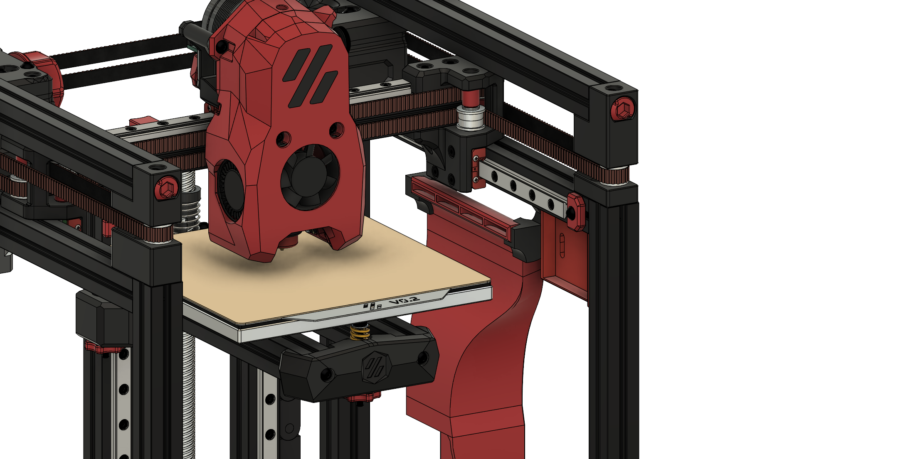

# Klicky compatible fan ducts
These ducts are designed to leave space at the front right corner for the klicky mounts are lower to make space for the carrier part on the cowling and blow the air across the bed at an angle.

**These are completely untested and highly experimental!**

So far there are unibody ducts for the 5015 and 6028 fans. The bottom mounts are the same as for the standard ducts. Due to the angle of the ducts there are new top mounts.

